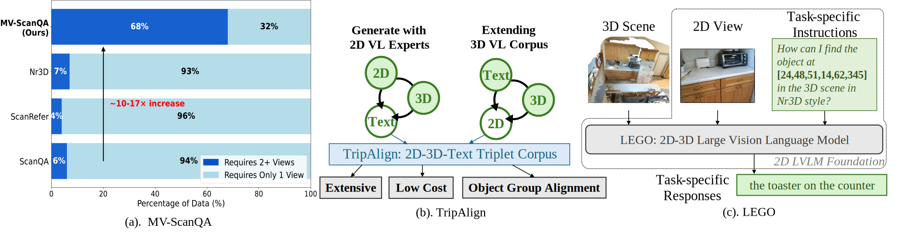

# _Advancing 3D Scene Understanding with MV-ScanQA Multi-View Reasoning Evaluation and TripAlign Pre-training Dataset_ - Official Codebase

This work is accepeted by ACM MM 2025. [Demo & Project Page](matthewdm0816.github.io/mv-scanqa/)



## Installation
0. Create a new conda environment if necessary with `python` 3.12.
1. Install  `torch` 2.1 following [PyTorch official website](https://pytorch.org/get-started/locally/), and related packages:
```bash
pip install -U pip
pip install uv # we recommend using `uv` to speed up pip installation
uv pip install torch==2.3.0 torchvision==0.18.0 torchaudio==2.3.0 --index-url https://download.pytorch.org/whl/cu121 # Example torch installation
uv pip install -r requirements.txt
```
2. (Optional) Adjust `transformers` version for stable replication in pre-training:
```bash
pip install transformers==4.35 tokenizers==0.14 --no-deps
```
3. Install Java to use METEOR evaluation package (for Scan2Cap evaluations).
4. Download [our compiled data](https://huggingface.co/datasets/kmichiru/SVC), and change `SVC_PATH` in `fuyu_utils.py` to your downloaded path.
5. Download and unzip ScanNet's sampled 2D views from [this link](http://kaldir.vc.in.tum.de/3dsis/scannet_train_images.zip) under `SVC_PATH/frames_square` or change the `--frame_path_scanqa/--frame_path_sqa3d/--frame_path_scan2cap` options of main training Python script.


## Results

Here are reproduced results from this cleaned script.
| Dataset                                | Results (Cleaned) | Results (Reported)
| -------------------------------------- | ------- | --- |
| ScanQA (val), EM                       | 28.0    | 28.4    |
| ScanQA (test with object), EM          |         | 33.7    |
| ScanQA (test without object), EM       |         | 32.7  |
| Scan2Cap (on ScanRefer), CiDER@0.25    | 82.8    | 84.7   |
| Scan2Cap (on ScanRefer), CiDER@0.5     | 76.7    | 78.6   |
| Scan2Cap (on Nr3D), CiDER@0.5          | 62.3    | 61.4   |
| MV-ScanQA, EM                          |         | 34.1   |
| SQA3D, EM                              |         |         |

## Quickstart

> **Note**: You can download the compiled data and checkpoints in the table below. 
Unzip and organize according to the guide below, and you're ready to go LEGO [Training](#training) and [Inference](#inference)!

| Component | Link |
| --- | --- |
| Compiled Data "SVC" | [Download](https://huggingface.co/datasets/kmichiru/SVC) |
| ScanNet 2D Views | [Download](http://kaldir.vc.in.tum.de/3dsis/scannet_train_images.zip) |
| Pre-Trained LEGO Checkpoint | [Download](https://huggingface.co/kmichiru/LEGO) |
| Mask3D Detection Results | [Download](https://huggingface.co/datasets/huangjy-pku/LEO_data/resolve/main/mask.zip) |
| LEO's Pre-processed Point Clouds (Only needed for data preparation) | [Download](https://huggingface.co/datasets/huangjy-pku/LEO_data/resolve/main/pcd_with_global_alignment.zip) |


We offer all pre-converted data in this [SVC Data Repo](https://huggingface.co/datasets/kmichiru/SVC), including:
- MV-ScanQA benchmark dataset and TripAlign pre-train datasets (generated captions for 2D views, and calculated instruction-view pairs for existing 3D vision-language datasets). We offer two versions of TripAlign: one with captions from LLaVA-1.5-7B, one with captions from GPT-4o.
- Pre-processed ScanNet scene data, including the sampled point cloud and 3D object annotations.
- Pre-trained 3D detector from Vote2Cap-DETR and its pre-extracted 3D object features.
- Pre-trained 3D feature adapter from 1st stage pre-training.
- Pre-computed IoSA ratios between each view and each 3D object for ScanNet scenes.

For 2D views, please download from [ScanNet's sampled 2D views](http://kaldir.vc.in.tum.de/3dsis/scannet_train_images.zip). After downloading the compiled data, please unzip `scannet_data.zip` into `<SVC_PATH>/scannet_data/`, and unzip `scannet_train_images.zip` into `<SVC_PATH>/frames_square/`.

For related files for view selection on detected object proposals from Mask3D, please download from LEO's [Data Repository](https://huggingface.co/datasets/huangjy-pku/LEO_data). Specifically, please download [Mask3D detection results on ScanNet](https://huggingface.co/datasets/huangjy-pku/LEO_data/resolve/main/mask.zip) and unzip under `<SVC_PATH>/save_mask` and [LEO's point cloud data](https://huggingface.co/datasets/huangjy-pku/LEO_data/resolve/main/pcd_with_global_alignment.zip) and unzip under `<SVC_PATH>/pcd_with_global_alignment`.

After data preparation, the directory structure should look like this:
```
<REPO_PARENT>/
|--<SVC_PATH>/
|  |--frames_square/    # unzipped ScanNet sampled 2D views
|  |--scannet_data/     # unzipped preprocessed ScanNet scene data
|  |--save_mask/        # unzipped Mask3D detection results on ScanNet
|  |--pcd_with_global_alignment/  # unzipped LEO's point cloud data
|  |--...
|--<REPO_PATH>/         # cloned this repository
|  |--finetune_fuyu.sh
|  |--finetune_fuyu_1st_stage.sh
|  |--...
```

We also provide final pre-trained LEGO checkpoints at [Another Huggingface Repo](https://huggingface.co/kmichiru/LEGO). 


> **Note**: some scripts might require pre-trained checkpoints downloading, so please set `HF_ENDPOINT` or `ALL_PROXY` appropriately if necessary.

## Data Preparation

### Pre-compute View-Object IoSA ratios
IoSA (Intersection over Smallest Area) ratios between each view and each 3D object are pre-computed for ScanNet scenes. To pre-compute them, run:    
```bash
python data_utils/calculate_view_object_iosa_map.py
```
This will generate a `scene_view_object_overlap_data.pkl` file that records the IoSA ratios between each view and each 3D object for each scene. This file can be used for
- visibility-based solvability analysis for current 3D vision-language datasets and our proposed two datasets.
- selecting best views for each instruction for tasks with certain object as input (e.g. Scan2Cap on ScanRefer and Nr3D).

> **Note**: The pre-computed file is also included in our compiled data.

### Compose ScanQA Questions into MV-ScanQA
We compose ScanQA questions into more complex multi-view questions by LLMs to form MV-ScanQA dataset:
```bash
# Configure your own api_key, model_name, base_url in `compose_mv_scanqa_from_question_pairs.py` first.
python data_utils/compose_mv_scanqa_from_question_pairs_mp.py
# Filter questions and annotate "n-views-can-solve" difficulty levels for each question
python data_utils/filter_scanqa_mv.py
```

### TripAlign (2D+3D $\Rightarrow$ Text): Caption Generation for TripAlign
We use pre-trained LVLM to generate captions for TripAlign dataset. The captions can be generated by either LLaVA-1.5-7B or and GPT-4o:
```bash
# For LLaVA-1.5-7B captions. Replace `SVC_PATH` in the script first.
python data_utils/caption_scannet_mt.py --scene_range 0-10000
```

```bash
# For GPT-4o captions
# You can also tweak the base_url and model_name in the script.
python data_utils/caption_by_api.py --directory <scannet_views_directory> --api_key <your_openai_api_key>
```
We found GPT-4o sourced captions are more accurate and detailed. We recommend using GPT-4o captions for better performance.

### TripAlign (3D+Text $\Rightarrow$ 2D): Extending Existing 3D Vision-Language Datasets with Paired Views
For question answering downstream tasks on existing 3D vision-language datasets, including ScanQA and SQA3D, and our proposed MV-ScanQA, select paired views for each instruction (i.e., question text) by the following command:
1. Install BLIP-related packages:
```bash
# [TODO]
```
2. Run selection:
```bash
# QA datasets (ScanQA, SQA3D, MV-ScanQA)
python data_utils/eval_scene_best_views.py --dataset (scanqa|sqa3d|scanqa_mv) --not_eval_vqa --nocheck_blank --outfile <output_file>
```
This will generate an `i2t` file for each input dataset, which sorts the relevance of each view to each instruction. The `i2t` file is used to select the best views for each instruction. For MV-ScanQA, after selecting views, we further select multiple diverse and related views for each question by the following command:
```bash
python data_utils/resample_views.py
```
For dense captioning tasks, we select views for each object in the scene with following commands:
```bash
# Dense Caption datasets (Scan2Cap task on ScanRefer and Nr3D datasets)
# For training (use ground truth object locations)
python data_utils/calculate_object_centric_views.py
# For evaluation/inference (use detected object proposals from Mask3D)
python data_utils/calculate_object_centric_views_for_mask3d.py
```

> **Note**: 
> - They're used in both pre-training stage and inference stage.
> - Paired views are selected only with the instruction input (i.e., question text for question answering tasks, and object location for dense caption tasks), without any access to task response annotations. 
> - For dense captioning, we select views for detector predicted object proposals at inference time, without any access to the ground truth object annotations.

## Training

> **Note**: Typically you need 40G VRAM to run training.

### Pre-extract 3D Object Features
1. Download pre-trained 3D detector from [Vote2Cap-DETR](ch3cook-fdu/Vote2Cap-DETR), or from our compiled Huggingface repository.
2. Compile and install PointNet++:
```bash
cd lib/pointnet2
python setup.py install
```
3. Run the following command to extract 3D object features:
```bash
./pre-extract-pnpp.sh
```


### TripAlign Pre-training
1. 1st stage pre-train a 3D feature adapter on a subset of TripAlign dataset, with LVLM frozen:
```bash
export CUDA_VISIBLE_DEVICES=0,1,2,3,4,5,6,7
./finetune_fuyu_1st_stage.sh
```
> **Note**: We found 1st stage pre-train makes only small difference on the final performance, so we recommend to skip this stage if you want to save time.

2. 2nd stage pre-train the full model on the full TripAlign dataset, with LoRA:
```bash
export CUDA_VISIBLE_DEVICES=0,1,2,3,4,5,6,7
./finetune_fuyu.sh
```

### Finetuning on Downstream Tasks
We only found finetuning beneficial for MV-ScanQA and SQA3D, so we provide the finetuning code for these two tasks. For other tasks, we recommend to use the pre-trained model directly.
```bash
# On MV-ScanQA
export CUDA_VISIBLE_DEVICES=0,1,2,3,4,5,6,7
./finetune_fuyu_mvscanqa.sh
```
```bash
# On SQA3D
export CUDA_VISIBLE_DEVICES=0,1,2,3,4,5,6,7
./finetune_fuyu_downstream.sh
```

## Inference
Once LEGO is trained, you can run inference on downstream tasks. Here we provide the ScanQA inference command as an example. For other tasks, please change the dataset options in the shell script.
```bash
./predict_fuyu.sh --checkpoint_path <checkpoint_path>
```

> **Note**: For ScanQA test splits performances, you need to submit the result files to its official [eval.ai evaluation platform](https://eval.ai/web/challenges/challenge-page/1715/overview).

## TODO
- [x] Upload pre-trained checkpoints; Upload scene-view-object IoSA ratios.
- [x] Upload pre-trained 3D detector; Upload 1st stage pre-trained 3D feature adapter.
- [x] Fix file locations
- [x] Add view selection codes and docs; Correct file locations.
- [x] Add gradient checkpointing for pre-training and finetuning, for low-memory GPUs like RTX 3090.
- [x] Update correct `accelerate+transformers+peft` versions in requirements.txt.
- [ ] Test cleaned scripts.
- [ ] Update inference for each dataset.
- [ ] Update bibtex.


## Acknowledgements
We would like to thank [facebookresearch/votenet](https://github.com/facebookresearch/votenet) and [ch3cook-fdu/Vote2Cap-DETR](https://github.com/ch3cook-fdu/Vote2Cap-DETR) for the 3D object detector code and pre-trained weights.

## Citation
If you find this codebase useful, please consider citing our work:
```bibtex
@inproceedings{mo2025mvscanqa,
  title={Advancing 3D Scene Understanding with MV-ScanQA Multi-View Reasoning Evaluation and TripAlign Pre-training Dataset},
  author={Mo, Wentao and Chen, QingChao and Peng, Yuxin and Huang, Siyuan and Liu, Yang},
  year={2025},
}
```

## License
This code repository and datasets are licensed under [CC-BY-4.0](https://creativecommons.org/licenses/by/4.0/) license.

Copyright (c) 2025 Wentao Mo.
